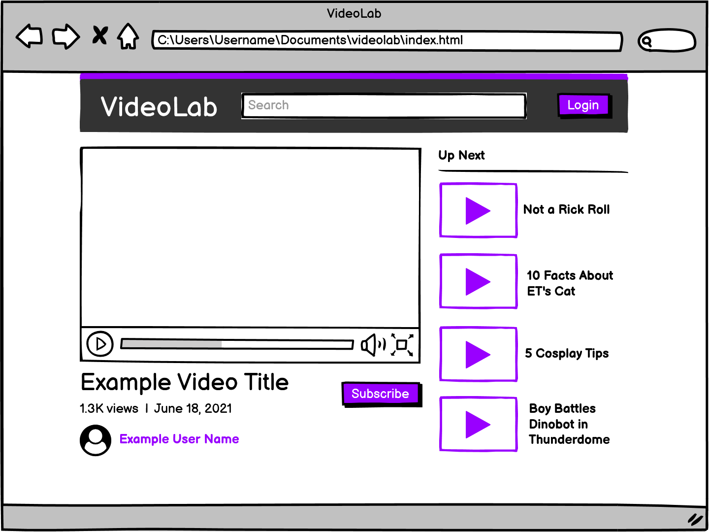

# Video Preview
This is an assignment completed for Coding Dojo focused on learning about user events such as `onmouseover` and `onmouseout`.
### Objectives:
* Add a `<video>` into the existing project
* When hovering over the video it should preview the content by playing the video on mute.
### Additional funcionality I added (For fun):
* Added another small video on the suggestions sidebar just for further practice.

## I was given this wireframe as a reference:

